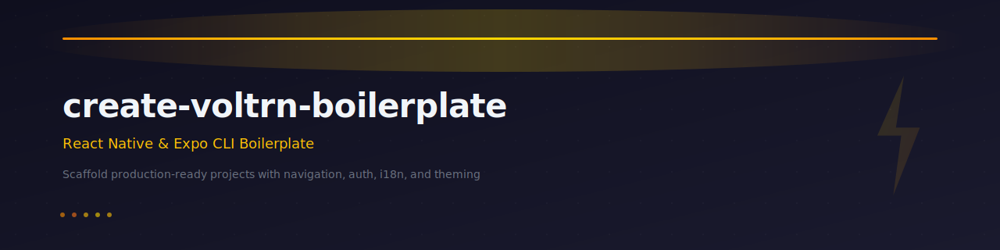

# VoltRN CLI (React Native/Expo project dynamic boilerplate)

<p align="center">
  
</p>

A powerful CLI tool to quickly scaffold **React Native** and **Expo** TypeScript projects with best practices.

## Features

- ✅ React Native CLI or Expo support
- ✅ Full TypeScript configuration with strict mode
- ✅ React Navigation or Expo Router
- ✅ i18n support with react-i18next and MMKV storage
- ✅ **NEW:** Complete authentication flow with JWT tokens
- ✅ Environment management (dev/staging/prod)
- ✅ Path aliases for clean imports
- ✅ Splash screen with react-native-bootsplash (auto-hide)
- ✅ App icon generation with @forward-software/react-native-toolbox
- ✅ Example screens with best practices
- ✅ Ready-to-use project structure

## Installation

### Prerequisites

Before installing the CLI, make sure you have the following installed:

- **Node.js** (v22 or higher recommended)
- **npm** (v6 or higher) or **yarn**
- For React Native CLI projects: **Xcode** (macOS) and **Android Studio** (for Android development)
- For Expo projects: **Expo CLI** (optional, but recommended)

### Installation Methods

#### Method 1: Using npx (Recommended) ⭐

The easiest way to use the CLI is with `npx`, which downloads and runs the latest version without installing it globally:

```bash
npx create-voltrn-boilerplate
```

This method:
- ✅ Always uses the latest version
- ✅ No global installation needed
- ✅ Keeps your system clean
- ✅ Works immediately

#### Method 2: Global Installation

Install the CLI globally to use it from anywhere:

```bash
npm install -g create-voltrn-boilerplate
```

After installation, you can run:

```bash
create-voltrn-boilerplate
```

**Note:** On macOS/Linux, you might need to use `sudo`:
```bash
sudo npm install -g create-voltrn-boilerplate
```

#### Method 3: Using Yarn

If you prefer Yarn:

```bash
# Global installation
yarn global add create-voltrn-boilerplate

# Or use with yarn create
yarn create voltrn-boilerplate
```

### Verify Installation

To verify the CLI is installed correctly:

```bash
# If installed globally
create-voltrn-boilerplate --version

# Or check if the command exists
which create-voltrn-boilerplate
```

### Updating the CLI

If you installed globally, update to the latest version:

```bash
npm update -g create-voltrn-boilerplate
```

Or reinstall:

```bash
npm install -g create-voltrn-boilerplate@latest
```

### Uninstallation

To remove the globally installed CLI:

```bash
npm uninstall -g create-voltrn-boilerplate
```

### Troubleshooting

#### Permission Errors (macOS/Linux)

If you encounter permission errors during global installation:

```bash
# Option 1: Use sudo (not recommended for security reasons)
sudo npm install -g create-voltrn-boilerplate

# Option 2: Fix npm permissions (recommended)
mkdir ~/.npm-global
npm config set prefix '~/.npm-global'
export PATH=~/.npm-global/bin:$PATH
# Add the export line to your ~/.zshrc or ~/.bashrc
```

#### Command Not Found

If the command is not found after installation:

1. Check if npm's global bin directory is in your PATH:
   ```bash
   npm config get prefix
   ```

2. Add it to your PATH (add to `~/.zshrc` or `~/.bashrc`):
   ```bash
   export PATH="$(npm config get prefix)/bin:$PATH"
   ```

3. Restart your terminal or run:
   ```bash
   source ~/.zshrc  # or source ~/.bashrc
   ```

#### Using npx Instead

If you continue having issues with global installation, just use `npx` - it works without any setup:

```bash
npx create-voltrn-boilerplate
```

## Usage

Run the CLI and follow the interactive prompts:

```bash
npx create-voltrn-boilerplate
```

You'll be asked:

1. **Project name** - Enter your project name
2. **Framework** - Choose between React Native CLI or Expo
3. **Navigation** - Choose React Navigation or Expo Router (Expo only)
4. **i18n** - Enable internationalization support
5. **Authentication** - Enable JWT-based auth flow
6. **Theming** - Enable dark/light mode support
7. **Screen names** - Define your own screen names (comma-separated)
8. **Navigation pattern** - Choose how screens are organized (non-auth only)

## Screen Customization

You can fully customize the screens generated in your project. Enter screen names as a comma-separated list (e.g., `Home, Profile, Settings, About`). Names are automatically converted to PascalCase.

### Navigation Patterns (without auth flow)

When not using the authentication flow, you can choose from 4 navigation patterns and assign each screen to a specific navigator:

| Pattern | Description |
|---------|-------------|
| **Stack** | Simple linear navigation with back/forward buttons |
| **Bottom Tabs** | Tab bar at the bottom; each screen can go in a Tab or Stack |
| **Drawer** | Side menu navigation; each screen can go in the Drawer or Stack |
| **Tabs + Drawer** | Combined tab bar and side menu; each screen can go in Tab, Drawer, or Stack |

For Tabs, Drawer, and Tabs + Drawer patterns, the CLI asks where each screen should go, so you can mix and match freely.

### Screen Configuration with Auth Flow

When the authentication flow is enabled, screens are organized into three categories:

- **Public screens** (default: `PublicHome`) - Accessible before login
- **Private tab screens** (default: `PrivateHome, Profile, Settings`) - Main app screens shown as bottom tabs after login
- **Private stack screens** (default: `Details`) - Detail/modal screens accessible from tabs

The auth flow always includes **Intro** and **Login** as fixed screens.

## i18n Support

When you enable i18n support, the CLI will set up:

- ✅ **i18next** with React Native integration
- ✅ **MMKV storage** for language persistence
- ✅ **Language detector** that uses device settings
- ✅ **English and Italian** translations included by default

### ⚠️ Important for Expo Projects

Since i18n uses `react-native-mmkv` which requires native code, **Expo projects** need to run:

```bash
npx expo prebuild
```

before starting the app. This generates the necessary native code for MMKV to work correctly.

After prebuild, you can start the app normally:

```bash
npx expo start -c
```

## Authentication Flow Feature

When you enable the authentication flow, the CLI will set up:

### What's Included

- ✅ **Auth Client** with `@forward-software/react-auth`
  - JWT token management (access + refresh)
  - MMKV persistent storage
  - Axios HTTP client
  - Automatic token refresh
  
- ✅ **Public Routes**
  - IntroScreen (landing page)
  - LoginScreen (email/password)
  - PublicHomeScreen (guest access with language selector)

- ✅ **Private Routes** (Tab Navigator)
  - PrivateHomeScreen (authenticated home)
  - ProfileScreen (token display + logout)
  - SettingsScreen (settings placeholder)
  - DetailsScreen (additional screen)

- ✅ **Custom Hooks**
  - `useAsyncCallback` - Handle async operations with loading states
  - `useUserCredentials` - Manage login form state

- ✅ **Full i18n Support**
  - English and Italian translations
  - All auth screens localized

### API Configuration

The authentication flow example uses the [Platzi Fake Store API](https://fakeapi.platzi.com/en/about/introduction/) as a demo backend. This is a free, public API that provides JWT-based authentication out of the box, making it ideal for testing the auth flow without setting up your own server.

**Default login credentials for the example:**

```
Email:    john@mail.com
Password: changeme
```

To connect to your own API, update the configuration in `src/env/env.js`:

```javascript
export default {
  API_URL: "https://your-api.com",
  ENVIRONMENT: "development"
};
```

Expected endpoints:
- `POST /v1/auth/login` - Returns `{ access_token, refresh_token }`
- `POST /v1/auth/refresh-token` - Refreshes tokens

### Documentation

Generated projects with auth flow include:
- `AUTH_FLOW.md` - Complete authentication documentation
- `IMPLEMENTATION_SUMMARY.md` - Implementation details

## Project Structure

```
your-project/
├── src/
│   ├── screens/           # Screen components
│   ├── components/        # Reusable components
│   ├── i18n/             # Internationalization
│   ├── mmkv/             # MMKV storage setup
│   ├── auth/             # Auth client (if enabled)
│   ├── hooks/            # Custom hooks (if auth enabled)
│   ├── navigators/       # Navigation setup (if auth enabled)
│   └── env/              # Environment config
├── navigation.d.ts       # Navigation types
└── app.json             # Environment configurations
```

## Environment Configuration

Environment variables are stored in `.env.*` files using standard `KEY=VALUE` format:

- `.env.development`  -Development environment
- `.env.staging`  -Staging environment
- `.env.production`  -Production environment
- `.env.example`  -Template with required keys (committed to git)

All `.env.*` files (except `.env.example`) are gitignored to keep sensitive values out of version control.

### Setting the Environment

Use the following npm scripts to switch between environments:

```bash
npm run env:dev      # Development
npm run env:stage    # Staging
npm run env:prod     # Production
```

This reads the corresponding `.env.*` file and generates `src/env/env.js` (also gitignored), which is imported via the `@env/env` path alias.

### Importing in Your Code

```typescript
import env from '@env/env';

const apiUrl = env.API_URL;
const environment = env.ENVIRONMENT;
```

### Adding New Variables

1. Add the new variable to each `.env.*` file:

```bash
# .env.development
API_URL=https://dev-api.example.com
API_KEY=dev-api-key
ENVIRONMENT=development
FEATURE_FLAG=true
```

2. Add the key (without a real value) to `.env.example` so other developers know it's required:

```bash
# .env.example
API_URL=
API_KEY=
ENVIRONMENT=
FEATURE_FLAG=
```

3. Regenerate `env.js`:

```bash
npm run env:dev
```

4. Use the new variable:

```typescript
import env from '@env/env';

const featureEnabled = env.FEATURE_FLAG;
```

### Important Notes

- ⚠️ **Do not commit sensitive data**  -`.env.*` files are gitignored; use `.env.example` to document required keys
- ⚠️ **Do not edit `src/env/env.js` manually**  -it is generated and will be overwritten
- ✅ Always run the appropriate `env:*` script before building for a specific environment

### Path Alias

The `@env/` path alias is configured in `babel.config.js` and `tsconfig.json`, allowing you to import from `@env/env` instead of using relative paths like `../../env/env`.

## Splash Screen & App Icons

Every generated project includes automatic splash screen and app icon setup:

- **Splash Screen** [react-native-bootsplash](https://github.com/zoontek/react-native-bootsplash) with auto-hide on app ready
- **App Icons** [@forward-software/react-native-toolbox](https://github.com/forwardsoftware/react-native-toolbox) generates all icon sizes from a single source

A default VoltRN placeholder logo is included so the project works out of the box.

### Customizing in Generated Projects

#### Splash Screen

1. Replace `assets/splashscreen.svg` (or `.png`) with your own logo
   - SVG recommended for best quality at all densities
   - If using PNG: minimum **1024x1024px**
2. Run:

```bash
npm run assets:splash
```

Customization flags:

| Flag | Description | Default |
|------|-------------|---------|
| `--background` | Background color (hex) | `1A1A2E` |
| `--logo-width` | Logo width at @1x in dp | `150` |
| `--platforms` | Target platforms | `android,ios` |
| `--dark-background` | Dark mode background (license key required) |  -|
| `--dark-logo` | Dark mode logo path (license key required) |  -|

#### App Icon

1. Replace `assets/icon.png` with your own image (PNG format, minimum **1024x1024px**)
2. Run:

```bash
npm run assets:icons
```

This generates all required sizes for both iOS and Android automatically.

## License

This project is licensed under the [Mozilla Public License 2.0](https://www.mozilla.org/en-US/MPL/2.0/). See the [LICENSE](LICENSE) file for details.

